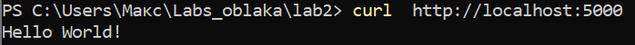

**Лабораторная работа 2 - Docker: плохие и хорошие практики**

**1. Постановка задачи**

1\) В рамках лабораторной работы требовалось:

2\) Написать \"плохой\" Dockerfile с не менее чем тремя плохими
практиками

3\) Написать \"хороший\" Dockerfile с исправлением этих практик

4\) Описать в README плохие практики и способы их исправления

5\) Описать 2 плохие практики по работе с контейнерами

**2. Ход работы**

**2.1 Создание директории**

Конечно, ключевым моментом является создание красивой директории наших
файлов, через Powershell я создал директории

mkdir Labs_oblaka/lab2

cd Labs_oblaka/lab2

**2.2 Создаем файлы для проекта**

Одной командой New-Item (ну я же крутой) создаю все необходимые файлы
для работы, а именно:

-Dockerfile.good

-Dockerfile.bad

README.md

App.py

Requirments.txt

**2.3 Пишем наше приложение по выводы в локальном хосте фразу «Hello
world!»**

Открывая app.py и пишу простой веб-сервер

(Да, это великий Thonny)

Это будет наше тестовое приложение.

**2.4 Создаем «плохой» Dockerfile (ошибки специально написаны, честно)**

Здесь допущены некоторые ошибки, даже целых 4, но некоторые из них не
так «плохи», как остальные:

1)  **Использование ubuntu:latest**

Проблема: Тег latest может меняться со временем, что приводит к
непредсказуемым сборка

Риск: Разные версии образа могут иметь разное поведение

2)  **Множественные RUN команды**

Проблема: Каждая команда RUN создает новый слой в образе

Результат: Увеличение размера итогового образа

В нашем случае: 5 отдельных RUN команд вместо одной объединенной

3)  **Установка ненужных пакетов**

Проблема: Установлены git и wget, которые не используются приложением

Результат: Бесполезное увеличение размера образа

4)  **Отсутствие очистки кэша**

Проблема: не очищается кэш apt, остаются ненужные файлы

Результат: Увеличение размера образа

**2.5 Пробуем собрать «плохой» образ**

Ииии, конечно же у нас вылетает ошибка. Ведь Docker ругается на
установку Flask. Это и есть одна из наши «плохих практик» - так делать
нельзя.

**2.6 Делаем «хороший» образ**

В Dockerfile.good записываем версию без глупых и необдуманных ошибок

Исправления в \"хорошем\" Dockerfile

**1. Конкретная версия образа**

Было: ubuntu:latest

Стало: ubuntu:20.04

Результат: Предсказуемость сборок

**2. Объединение RUN команд**

Было: 5 отдельных RUN команд

Стало: Одна объединенная команда с && \\

Результат: Уменьшение количества слоев и размера образа

**3. Удаление ненужных пакетов**

Было: Установлены git, wget

Стало: только необходимые пакеты

Результат: Уменьшение размера образа

**4. Добавление очистки**

Добавлены: apt-get clean и rm -rf /var/lib/apt/lists/\*

Результат: Удаление ненужных файлов, уменьшение размера

**5. Безопасность**

Добавлено: Создание non-root пользователя

Результат: Повышение безопасности контейнера

**2.7 Собираем «хороший» образ**

**docker build -t good-app -f .\\Dockerfile.good .**

Видим, что все работает успешно, теперь можем запускать контейнер
командой

Теперь проверим на локальном хосте

Вуаля! Наш образ работает и выдает нам наше заветное приветствие миру

Также проверим работу приложения

Да, все работает, отлично

**3. Плохие практики в работе с контейнерами**

**1) Запуск контейнеров с привилегиями root**

> По умолчанию все контейнеры запускаются от root, что создает угрозы
> безопасности

Решение:

Использование USER директивы в Dockerfile

Запуск с флагом \--user в docker run

**2) Хранение данных в контейнере**

> Проблема: Хранение важных данных внутри контейнера приводит к их
> потере при удалении контейнера

Решение:

Использование Docker volumes для постоянного хранения данных

Монтирование host-директорий при необходимости

**4. Вывод по работе**

Без вывода никуда) Во время решения лабораторной работы были созданы два
Dockerfile: один из них был «плохим», который даже не смог собрать образ
из-за того, что кто-то не продумал, что определенные функции могут не
работать в прошлых и новых системах. Второй же был «хорошим», который
был написан из «плохого», но с решением всех проблем из него.

«Хороший» образ был успешно собран и запущен, приложение корректно
работает на порту 5000.

P.s На самом деле лабораторная оказалась очень интересной, во время
таких работы я старался пользоваться только терминалом, конечно
некоторые функции я не знал и приходилось гуглить, но эти эмоции ничем
не заменить. Также, конечно, я столкнулся с проблемой связанной с WSL,
но обошел ее, используя другую функцию.

Спасибо за интересную работу!

Еще забыл упомянуть файл requirements, в нем лишь одна строчка

flask=2.3.3

Спасибо за внимание!
